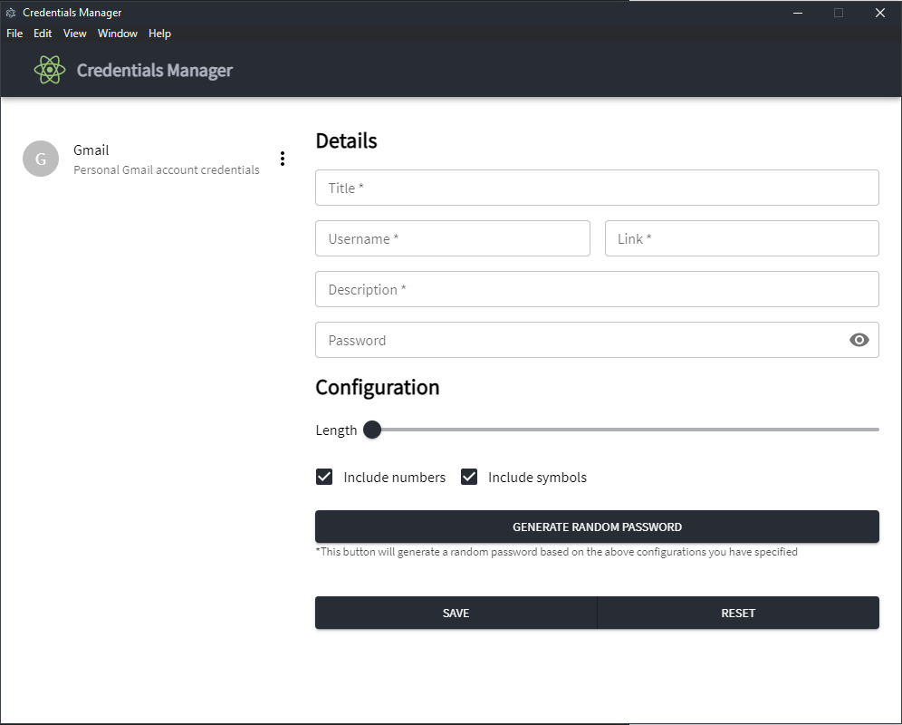

### Password Manager

**A simple desktop application to manage all your passwords from a single place.**

#### Tach Stack
*For this project I went with **ReactJS** and **ElectronJS** as the two framworks. ReactJS is used for rendering the entire application as well as house the different logic for storing, retrieving and updating user credentials.*

#### Current version and future plans
*Currently the feature set includes - adding new credentials, viewing stored credentials and editing stored credentials. To do task would be add a master passphrase which will be used to encode the stored passwords as well set a isProtected flag to desired passwords so that viewing them will require the use of the master passphrase.*
